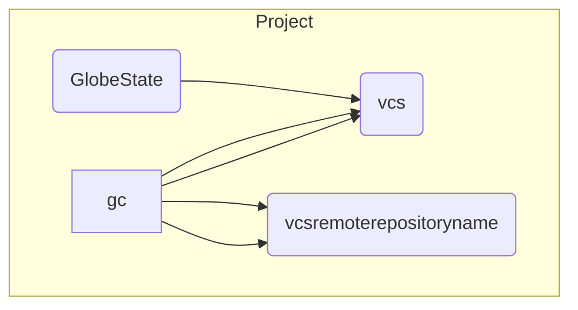

<!-- markdownlint-configure-file { "MD010": false } -->

# Concepts

## Problem Statement

<!-- // TODO  -->

-  manage static objects across repositories

   -  config files
      -  Taskfiles
      -  linting configs
      -  styling configs - ci /cd - git hooks - editor settings (not as releveant)
   -  other core things
      -  licenses
      -  readme
      -  .github/\*

-  manage dynamic actions
   -  lint all javascript
   -  format all markdown
   -  format readme file
      -  badges

## Solution

-  copy config files over
-  merge config files over
-  anything merged should have a #COMMENT_GLOBE_DID_THIS so we can modify it later

### Solution Dependencies

-  file endings on the file system
   -  depending on what files are in the project, merge different things together
-  merge types
   -  complete override
   -  propert add (json, yaml, toml)
   -  plain text merge have #COMMENT pragmas like ANSIBLE does in their files
   -  diff and ask what to save as

## Required Information

